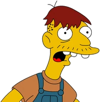

```{r setup, include=FALSE}
suppressPackageStartupMessages({
  library(DiagrammeR)
  library(tidyverse)
  library(knitr)
  library(airway)
  library(ggpubr)
  library(patchwork)
})
options(htmltools.dir.version = FALSE)

xaringanExtra::use_extra_styles(
  hover_code_line = TRUE,
  mute_unhighlighted_code = TRUE
)
#xaringanExtra::use_fit_screen()
xaringanExtra::use_animate_css()
xaringanExtra::use_tile_view()
```


class: inverse, clear, animated, fadeIn
background-image: url('illustrations/diverse.jpg')
background-position: top
background-size: cover

.slogan[*Diverse* target audience]

.footnote[Photo by Amy Elting on Unsplash]


---
class: inverse
# Presentation takeaways


- .Large[Define "*transcriptomic*" sequencing and its relevance]

--

- .Large[Recognize structure of sequencing data]

--

- .Large[Outline a simple analysis pipeline with bash]

--

- .Large[Identify concept and advantages of a Snakemake workflow]<br/>
  (How I avoid using bash as much as possible)

--

- .Large[Connect a workflow with R analysis scripts]

--

- .Large[Introduction to software management across platforms]

--

- .Large[Fun with 📦 packages and R tweaks]


---
class: inverse, center, middle

.Large[
Slides:

https://github.com/asgeissler/2024-CopenhagenR-Seminar

Snakemake tutorial workflow:

https://github.com/asgeissler/2024-Snakemake-Intro
]


---

class: inverse, clear, animated, pulse
background-image: url('illustrations/galaxy.jpeg')
background-size: cover

.slogan[
Big data with<br/>
*astronomically* large datasets
]

.footnote[Photo by Greg Rakozy on Unsplash]


---
class: clear, animated, swing
background-image: url('illustrations/meme-big-data.jpeg')
background-size: cover


---
# Big Data: Astronomical or Genomical?

<br />
<br />

```{r, echo=FALSE}

```

.footnote[Stephens, et al. PLOS Biology 2015]


---
# Gene expression: From genome, over RNA, to proteins

.center[
```{r, echo=FALSE, out.width='80%'}

```
]


---
class: clear, inverse
background-image: url('illustrations/plans.jpg')
background-size: cover

.footnote[Photo by Evgeniy Surzhan on Unsplash]

--

.slogan[-ome suffix: *A totality of some sort*]


---
# Differences in gene expression drive phenotypes

.pull-left[.Large[

- ⚙️ Cell tissue

- 🧬 Genome

- 🌲 Environment & 💊 Exposure

- ☠️ Disease associate factors

]]

.pull-right[
```{r, echo=FALSE, out.width='80%'}
include_graphics('illustrations/gtex.png')
```
]

.footnote[Figure from the GTEx Consortium, Science 2020]


---
class: clear, inverse
background-image: url('illustrations/plans.jpg')
background-size: cover

.slogan[Transcriptomic analysis:<br/> What is happening in the cells?]

.footnote[Photo by Evgeniy Surzhan on Unsplash]


---
class: inverse, clear
background-image: url('illustrations/radio.jpg')
background-size: cover


.footnote[Photo by Dave Weatherall on Unsplash]


---
class: inverse, clear
background-image: url('illustrations/tools.jpg')
background-size: cover


.footnote[Photo by Barn Images on Unsplash]


---
class: inverse
background-image: url('illustrations/shotgun.jpg')
background-size: cover

# Biologist's preferred tool


.footnote[Photo by Stephen Baker on Unsplash]

--
.slogan[Bioinformatics simplified:<br/> Putting the pieces back together...]


---
class: inverse
background-image: url('illustrations/sand-glass.jpeg')
background-size: cover

# The *pre*-R fun bottleneck


.pull-right[
Biological *high-throughput* measurements

- RNA Sequencing data
- Terabytes of $> 100$ compressed txt's
- Specialized tools (bash scripts) 
- Long running times

]

.footnote[Photo by Nathan Dumlao on Unsplash]

--

.pull-right[
Intermediate result:  
Count Matrix $< 100$ MB  
Rows: Genes, Columns: Samples/Patients
]

--

.pull-right[
Data exploration and analysis    
(R scripts / notebooks)

]


---
# Transcriptomic "airway" dataset from 2014

.center[
```{r, echo=FALSE, out.width='70%'}

```
]

.Large[
- Freely and openly available (without ethics board)

- RNA sequencing datasets for Asthma drug treatment vs control

- $4$ human cell lines (genotypes)
]


---
# Downloading the human genome


.pull-left[
.center[
```{r, echo=FALSE, out.width='90%'}
include_graphics('illustrations/gencode.png')
```
]

.footnote[https://www.gencodegenes.org/]
]

.pull-right[
Copy and paste links from website:

.small[
```
$ URL="https://ftp.ebi.ac.uk/pub/\
  databases/gencode/\
  Gencode_human/release_44/"

$ wget $URL/GRCh38.primary_assembly.genome.fa.gz \
  -O genome.fna.gz
  
$ wget $URL/gencode.v44.basic.annotation.gff3.gz \
  -O genome.gff.gz
```
]
]


---
# 🧬 🕺 🧍‍♀️👶

$806$ MBytes compressed text; $3$ GBytes uncompressed

.large[
```
$ gunzip -c genome.fna.gz| less
>chr1 1
NNNNNNNNNNNNNNNNNNNNNNNNNNNNNNNNNNNNNNNNNNNNNNNNNNNNNNNNNNNN
...
TGCTCATGAAGTGTGAGTTAATGCACTCAAATCAATGGTTGTGCACGGTTTATATGAATA
TTAGTGATTACAAAATATTATCAATAGACCTTGTCACAACTGTTATTGAAGAACTAATCA
TCTATTGCTTATTTAGGTCTTTCTCTCCTGCCAGAATGTGCGCTCCAGGTGGAGAGGTAT
GTTGCCTTATCCGTGGCTGGATATATAGAGATTCCCACACTGCCTTGCACACGAGCACTG
CTGGGTAAATATTTGTTGGCTGCAGGAAAACGTGAAGGAATAGGCCCTCCAATGGGAGGA
...
>chr2 2
...
```
]


---
# Gene annotations

$34$ MBytes compressed, $902$ MBytes uncompressed

.small[
```
$ gunzip -c genome.gff.gz | less
##gff-version 3
#description: evidence-based annotation of the human genome (GRCh38), version 44 (Ensembl 110)
[...]
chr1	HAVANA	gene	11869	14409	.	+	.	ID=ENSG00000290825.1;[...];gene_name=DDX11L2;[...]
...
```
]

Chromosome 1 has a gene at positions $11,869$ to $14,409$ on the $+1$ strand.

--


```{r, echo=FALSE, out.width='90%'}

```


Figure from https://genome-euro.ucsc.edu


---
# Dataset access: Sequence Read Archive

.Large[
From publication text: *"The RNA-Seq data is available at..."*
]

.center[
```{r, echo=FALSE, out.width='60%'}

```
]

https://trace.ncbi.nlm.nih.gov/Traces/?view=study&acc=SRP033351


---
# Downloaded sample files

.large[
- **Option 1**: Using the custom `SRA Toolkit` (bash...)

- **Option 2**: Clicking on website
]

```
$ ls
raw-data    genome.fna.gz   genome.gff.gz

$ ls -1 raw-data
SRR1039508_1.fastq.gz   # (control sample)
SRR1039508_2.fastq.gz
SRR1039509_1.fastq.gz   # (asthma treated case)
SRR1039509_2.fastq.gz
...
```

In this dataset, the files are $3.3-7.3$ GBytes large  
( $0.9-1.7$ GBytes compressed)


---
# Paired-end sequencing data

.pull-left[
.center[
```{r, echo=FALSE, out.width='60%'}
include_graphics('illustrations/mirror.jpg')
```
]

]

.pull-right[

.large[
```
> ls -1 raw-data
SRR1039508_1.fastq.gz
SRR1039508_2.fastq.gz
...
```
]

.Large[
The data contains the "*front*" and the "*back*"
of the sequenced read
]

.footnote[Photo by Taylor Smith on Unsplash]
]


---
# Lots of compressed text files

.large[
```{bash, eval=FALSE}
> gunzip -c data/SRR1039508_1.fastq.gz | head
@SRR1039508.1 HWI-ST177:290:C0TECACXX:1:1101:1225:2130 length=63
CATTGCTGATACCAANNNNNNNNGCATTCCTCAAGGTCTTCCTCCTTCCCTTACGGAATTACA
+SRR1039508.1 HWI-ST177:290:C0TECACXX:1:1101:1225:2130 length=63
HJJJJJJJJJJJJJJ########00?GHIJJJJJJJIJJJJJJJJJJJJJJJJJHHHFFFFFD
...
```
]

--

.Large[
That look like one of those **ACTG** genome thingies!
]

```{r, echo=FALSE, out.width='15%'}

```


---
# Goal: Number of reads mapping to a gene

```{r, echo=FALSE, out.width='95%'}

```


---
class: clear, animated, rotateIn
background-image: url('illustrations/text-lookup.jpg')
background-size: contain


---
# Sequencing quality filtering is needed

.Large[
$-10 \cdot log_{10}($ Probability of sequencing error $)$

Encoded as single, *printable ASCII* character
]

(details depend on the sequencing platform manufacturer)

```{r, echo=FALSE, out.width='90%'}
include_graphics('illustrations/phred.png')
```

.footnote[https://usegalaxy.be/training-material//topics/metagenomics/tutorials/metatranscriptomics/slides-plain.html]


---
# Efficient sequence mapping algorithm is needed

.large[
- Short reads: $< 100$ nucleotides (characters)

- This dataset: $13-34$ million read pairs, per sample

- Human genome: $>  3.1$ billion base pairs (characters)
]

--

.Large[
~~Naive string lookup~~
]

```{r, echo=FALSE, out.width='15%'}

```


---
# Efficient sequence mapping algorithms

.wide[
.Large[
2. Search via a phonebook-like index structure  
  (*e.g.*, Burrows–Wheeler Transformation)
3. *Approximate* via sequence spectrum  
  (*k*-mer frequency)
]

Suggested reading:<br />
Li, Durbin. Bioinformatics 2009 https://doi.org/10.1093/bioinformatics/btp324<br/>
Patro, *et al.* Nature Methods 2017 https://doi.org/10.1038/nmeth.4197

]

.narrow[
```{r, echo=FALSE, out.width='100%'}

```

.small[Photo by Johnny Briggs on Unsplash]
]


---
# Outline processing pipeline

.center[
```{r, echo=FALSE}
g <- mermaid("
graph TB
    gff[Gene annotations]
    fna[Genomic sequences]
    ix[Index]
    raw[Sequencing data]
    clean[Quality Control]
    map[Genome mapping]
    x[Gene expression matrix]
    fun[R analysis]
    raw --> clean
    clean --> map
    fna --> ix
    ix --> map
    map --> x
    gff --> x
    x --> fun
", height = '100%', width = '100%')
g
# networkD3::saveNetwork(g, "g.html")
# webshot::webshot("g.html", "g.png", vheight = 50)
```
]


---
# Bash programming primer

```
qcTool raw-data/sample1.fastq.gz > clean-data/sample1.fastq.gz
qcTool raw-data/sample2.fastq.gz > clean-data/sample2.fastq.gz
qcTool raw-data/sample3.fastq.gz > clean-data/sample3.fastq.gz
qcTool raw-data/sample4.fastq.gz > clean-data/sample4.fastq.gz
...
```

--

Slightly better solution

```
for i in raw-data/*fastq.gz ; do
  filename=$(basename $i)
  qcTool $i > clean-data/$filename
done
```


---
# Conceptual bash pipeline

.pull-left[
```{r, echo=FALSE}
g <- mermaid("
graph TB
    gff[Gene annotations]
    fna[Genomic sequences]
    ix[Index]
    raw[Sequencing data]
    clean[Quality Control]
    map[Genome mapping]
    x[Gene expression matrix]
    fun[R analysis]
    raw --> clean
    clean --> map
    fna --> ix
    ix --> map
    map --> x
    gff --> x
    x --> fun
", height = '100%', width = '100%')
g
# networkD3::saveNetwork(g, "g.html")
# webshot::webshot("g.html", "g.png", vheight = 50)
```
]


.pull-right[
.small[A file `concept-pipeline.bash`]

```
for i in raw-data/*.fastq.gz ; do
  filename=$(basename $i)
  qcTool $i > clean-data/$filename
done

makeIndex genome.fna.gz index

for i in clean-data/*.fastq.gz ; do
  filename=$(basename $i .fastq.gz)
  mapTool index $i > mapping/$filename.bam
done

countExpression annotation.gff.gz mapping/*  \
  > matrix.txt
```
]


---
# https://github.com/asgeissler/2024-Snakemake-Intro/

.center[
```{r, echo=FALSE, out.width='70%'}

```
]


---
class: inverse
# Bash concerns

.Large[

- Adding new samples? Re-run pipeline & over-write files?

- Running steps in parallel?

- Consistency when changing parameters?

- Software management?
]


---
# Snakemake to the rescue 🐍🦸‍♂️

.center[
```{r, echo = FALSE, out.width='65%'}

```
]

.small[Slide by Johannes Köster
https://slides.com/johanneskoester/snakemake-tutorial
]


---
# Towards Snakemake 👨‍🍳 "cooking" rules 📚 🍳 


.large[
```
$ cat Snakefile

rule make_my_index:
    input:
        'genome.fna.gz'
    output:
        'index'
    shell:
        """
        makeIndex {input} {output}
        """
```
]

--

`snakemake --cores all make_my_index`

or

`snakemake --cores all index`


---
# Wildcard placeholders

```
rule qc_cleaning:
    input:
        'raw-data/{sample}.fastq.gz'
    output:
        'clean-data/{sample}.fastq.gz'
    shell:
        """
        qcTool {input} > {output}
        """
```

--

```
$ snakemake --cores all clean-data/sample1.fastq.gz
Select jobs to execute...
rule qc_cleaning:
    input: raw-data/sample1.fastq.gz
    output: clean-data/sample1.fastq.gz
    jobid: 1
    reason: Missing output files: clean-data/sample1.fastq.gz
    wildcards: sample=sample1
```


---
# Rules with list and named parameters

.small[
```
xs = ['sample1', 'sample2', 'sample3', 'sample4']

rule count_expression:
    input:
        genome = 'genome.gff.gz',
        mapping = expand('mapping/{sample}.bam', sample = xs)
    output:
        'matrix.txt'
    shell:
        """
        echo "I am the named genome input: {input.genome}"
        echo "We are the input mappings: {input.mapping}"
        echo "I am the first mapping: {input.mapping[0]}"
        
        countExpression {input} > {output}
        """

```
]

--

```
$ snakemake --cores all matrix.txt
...
I am the named genome input: genome.gff.gz
We are the input mappings: mapping/sample1.bam mapping/sample2.bam mapping/sample3.bam...
I am the first mapping: mapping/sample1.bam
```


---
class: inverse, clear


.Large[
```
$ qcTool
bash: qcTool: command not found
```
]


.Large[
What are the actual tools, and how to use them?
]

--

.Large[
Thank you for this short intro to bash...
]

--

.Large[
But: Can we do with less bash coding, please?
]


---
# 🐍 Snakemake 🎁  wrappers

.center[
```{r, echo=FALSE, out.width='70%'}

```
]

.small[https://snakemake-wrappers.readthedocs.io/en/stable/wrappers/star/index.html]


---
# 📦 Automatic dependencies resolution

```{r, echo=FALSE, out.width='90%'}

```

.small[https://snakemake-wrappers.readthedocs.io/en/stable/wrappers/star/index.html]


---
# Tutorial workflow

```{r, echo=FALSE, out.width='80%'}

```


---
#Tutorial workflow


.large[
```
$ git clone https://github.com/asgeissler/2024-Snakemake-Intro/
$ cd 3-Tutorial-Workflow
$ snakemake --cores all --use-conda --conda-frontend=mamba \
     gene-expression-matrix.tsv
```
]

Should run in $< 15$ min on a notebook

```
$ head -n 3 gene-expression-matrix.tsv
Geneid            Chr  Start End         Strand Length SRR1039508 SRR1039509 SRR1039512 SRR1039513
ENSG00000223587.2 chr3 11745 24849          +   13105  0           1         0          0
ENSG00000224918.1 chr3 53348 54346          -   999    0           0         0          0

$  grep ENSG00000163884.4 gene-expression-matrix.tsv
ENSG00000163884.4  chr3 126342635 126357408 - 14774    220         3384      128        1518
```


---
class: inverse
background-image: url('illustrations/sand-glass.jpeg')
background-size: cover

# The end of the *pre*-R fun bottleneck

.pull-right[
Intermediate result:  
Count Matrix $< 100$ MB  
Rows: Genes, Columns: Samples/Patients
]

--

.pull-right[
```{r, echo=FALSE, out.width='80%'}
include_graphics('illustrations/Rlogo.png')
```
]


---
# Data and software from Bioconductor


.clear[
.thirds[
```{r, echo=FALSE, out.width='100%'}
include_graphics('illustrations/logo_bioconductor.gif')
```

https://bioconductor.org/
]
.double-r[.Large[
"The mission of the Bioconductor project is
[...] **open source** software
[...] rigorous and **reproducible** analysis
[...] welcoming **community** of developers and data scientists."
]]

]

--

.clear[
.wide[.large[
*"The Bioconductor community is a long-term user of __S4__ and has produced much
of the best material about its __effective use__. "*<br/>
— Hadley Wickham
]]
.narrow[
```{r, echo=FALSE, out.width='60%'}
include_graphics('illustrations/cover-advancedR.png')
```
]
]


---
# {airway} 📦 

```{r, eval=FALSE}
install.packages("BiocManager")
BiocManager::install("airway")
```

```{r}
library(airway)
data(airway)
airway
```


---
# {airway} 📦 

Memo R pipes: `g(f(x))` is `x |> f() |> g()`<br/>
(`|>` ligature, typed `| >`)


```{r}
airway |>
  assay() |>
  as.matrix() |>
  _[1:5, 1:5]
```


.Large[
The full
matrix of gene (row) expression levels per sample (columns) from
the *pre-R* fun step.
]


---
# Sample meta information

 
`colData`: Column meta information data

```{r}
airway |> colData() |> as_tibble() |> head(n = 3) |> kable()
```

.Large[Asthma drug treated (`trt`) or control (`untrt`)]

.footnote[
`kable()` from {knitr} 📦 makes pretty tables in these slides<br/>
S4 class: `colData(airway)` accessed the object's slot `airway@colData`
]


---
# 🧬 🙋‍♂️ Our Genes

```{r}
airway |>
  rowData() |> as_tibble() |>
  select(gene_id, gene_name, chromosome = seq_name,
         gene_seq_start, gene_seq_end, seq_strand) |>
  filter(chromosome == 'X') |>
  arrange(gene_seq_start) |>
  mutate_if(is.numeric, prettyNum, big.mark = ',') |>
  head(n = 3) |> kable()
```

.large[tibbles are the better dataframes {tidyverse} 📦 🧹]


---
# *Tidy* data exploration

.pull-left[
```{r}
# One  dexamethasone drug treated library
my.data <-
  airway |>
  assay() |>
  as_tibble(rownames = 'gene_id') |>
  select(gene_id, expression = SRR1039509)
my.data |> head(n = 3) |> kable()
```

]

.pull-right[
```{r}
my.genes <-
  airway |>
  rowData() |>
  as_tibble() |>
  select(gene_id, gene_name, chromosome = seq_name,
         gene_seq_start, gene_seq_end, seq_strand)
my.genes |> str() #<<
```
]


---
# Use the join!

.pull-left[
.Large[
```{r}
my.genes.data <- full_join(
  my.genes,
  my.data,
  by = 'gene_id'
)
```
]
]

.pull-right[
```{r, echo=FALSE, out.width='70%'}

```

]

```{r, echo=FALSE}
my.genes.data |> head(n = 3) |> kable()
```


---
# A first genomic expression figure with {ggplot2}


.pull-left[
.large[
```{r}
plot1 <-
  my.genes.data |>
  filter(chromosome == '1') |>
  mutate_at('seq_strand',
            as.character) |>
  ggplot(aes(
    x = gene_seq_start, 
    y = expression,
    color = seq_strand),
  ) +
  geom_point(alpha = .5) +
  scale_y_log10() +
  xlab('Chromosome 1 [bp]')
```
]
]

--

.pull-right[
```{r, fig.width=8, fig.height=5, echo=FALSE, warning=FALSE}
plot1
```

```{r, out.width='60%', echo=FALSE}
knitr::include_graphics('illustrations/chromosome.jpg')
```
]


---
# Motivation normalization

.pull-left[
.large[
```{r}
scatter.plot <-
  airway |>
  assay() |>
  as_tibble() |>
  ggplot(aes(x = SRR1039517,
             y = SRR1039513)) +
  geom_point(alpha = 0.5) +
  geom_abline(slope = 1,
              color = 'blue') +
  scale_x_log10() +
  scale_y_log10()
```
]
]

.pull-right[
```{r, echo = FALSE, warning=FALSE}
scatter.plot
```
]


---
# Which waterway has more fish?

.pull-left[
```{r, echo=FALSE, out.width='100%'}

```
]
.pull-right[
```{r, echo=FALSE, out.width='100%'}

```
]


.footnote[
Photos by Mega Caesaria and  Rick Wallace on Unsplash
]


---
# RNA-seq data normalization


.large[
Potential method, size-factor normalization:

Per library (column) compute the
median ratio of gene counts relative to geometric mean per gene (row)
]


Suggested reading:

Anders S and Huber W.
[Differential expression analysis for sequence count data.](https://www.nature.com/articles/npre.2010.4282.1)
Nature Preceding 2010


RNA-seq analysis workflow tutorial on Bioconductor:

https://bioconductor.org/packages/release/workflows/vignettes/rnaseqGene/inst/doc/rnaseqGene.html


---
# Differential expression analysisw with {DESeq2}


.large[
```{r, eval = FALSE}
library(DESeq2)

des <-
  airway |>
  # convert to DataSet for DESeq
  # analyse expression by cell line and dex treatment
  DESeqDataSet(design = ~ cell + dex) |>
  # Run DESeq2 normalization and regression models
  DESeq()

# Statistical results
res <- results(des, tidy = TRUE)
```
]


RNA-seq analysis workflow tutorial on Bioconductor:

https://bioconductor.org/packages/release/workflows/vignettes/rnaseqGene/inst/doc/rnaseqGene.html


---
# Statistical analysis of expression changes


$$
\text{Expression Fold Change} =  \frac
{\text{Expression in condition A}}
{\text{Expression in condition B}}
$$

--


```{R, echo = FALSE}
tribble(
  ~ A, ~B,
  100, 100,
  100, 50,
  100, 200
) |>
  mutate(
    'Fold Change' = A / B,
    'log2' = log2(`Fold Change`)
  ) |>
  knitr::kable()
```


--

.large[
Testing for statistical significance and false discovery rate (FDR) adjustment
]


---
# Analysis results

.pull-left[
```{r, eval = FALSE}
res |>
  ggplot(aes(log2FoldChange, - log10(padj))) +
  geom_point() +
  theme_bw(18)

ggsave('volcano.jpeg')
```
]
.pull-right[
```{r, echo = FALSE}

```
]


---
# Hello academic paper writing phase

```{r, eval = FALSE}
my.analysis <-
  res |>
  filter(padj <= 0.05, abs(log2FoldChange) >= 1) |>
  left_join(airway |> rowData() |> as_tibble(), c('row' = 'gene_id')) |>
  select(gene_id = row, gene_name, log2FoldChange, FDR = padj) |>
  arrange(FDR)
```


|gene_id         |gene_name | log2FoldChange| FDR|
|:---------------|:---------|--------------:|---:|
|ENSG00000152583 |SPARCL1   |      -4.57|   < 1e-100|
|ENSG00000165995 |CACNB2    |      -3.29|   < 1e-100|
|ENSG00000120129 |DUSP1     |      -2.94|   < 1e-100|
|ENSG00000101347 |SAMHD1    |      -3.76|   < 1e-100|
|ENSG00000189221 |MAOA      |      -3.35|   < 1e-100|
|ENSG00000211445 |GPX3      |      -3.73|   < 1e-100|


---
# Dealing with the office devil {openxlsx}

.large[
```{r, eval = FALSE}
library(openxlsx)

my.analysis |>
  write.xlsx('my-analysis.xlsx')
```
]

.center[
```{r, echo = FALSE, out.width='60%'}

```
]


---
class: inverse, clear
background-image: url('illustrations/shotgun.jpg')
background-size: cover

.slogan[Happy customer!]


.footnote[Photo by Stephen Baker on Unsplash]


---
# 🏴‍☠️ R and 🐍


.pull-left[
```
rule my_analysis:
    input:
        script = 'analysis.R',
        data = 'gene-expression-matrix.tsv'
    output:
      'volcano.jpeg',
      'my-analysis.xlsx'
    shell:
        "RScript {input.script}"
```
]
.pull-right[
.large[
- Pro tip: Define script as input (triggers rerun on changes)

- Explicitly list data input, such that script gets executed at the right time

- Increase reproducibility by declaring software environment with conda
]

]

.footnote[
Snakemake Handbook:

https://snakemake.readthedocs.io/en/stable/snakefiles/deployment.html#integrated-package-management
]


---
class: clear
background-image: url('illustrations/shoes.jpg')
background-position: bottom
background-size: cover

.slogan[
There is no "one size fits all" expression analysis workflow
]

.footnote[Photo by Julian Hochgesang on Unsplash]


---
class: inverse
# Presentation takeaways


- .Large[Define "*transcriptomic*" sequencing and its relevance]

- .Large[Recognize structure of sequencing data]

- .Large[Outline a simple analysis pipeline with bash]

- .Large[Identify concept and advantages of a Snakemake workflow]<br/>
  (How I avoid using bash as much as possible)

- .Large[Connect a workflow with R analysis scripts]

- .Large[Introduction to software management across platforms]

- .Large[Fun with 📦 packages and R tweaks]


---
class: inverse, clear
background-image: url('illustrations/copenhagen.jpg')
background-position: top
background-size: cover

.slogan[
Thank you for joining!
]

.footnote[Photo by Peter Lloyd on Unsplash]


---
class: inverse, clear
background-image: url('illustrations/copenhagen.jpg')
background-position: top
background-size: cover

.slogan[
Supervisors: SE Seemann, J Gorodkin

Independent Research Fund Denmark
]

.footnote[Photo by Peter Lloyd on Unsplash]

